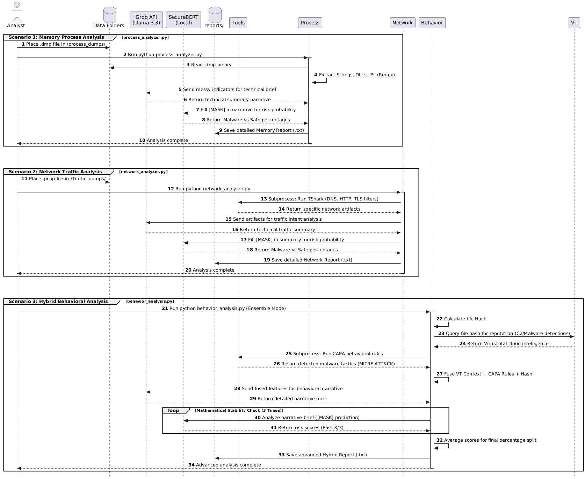

## 🔄 System Workflow
The following sequence diagram illustrates how data flows between the local forensic tools, the Groq LLM, and the SecureBERT classification engine.



# SecureBERT: Hybrid Malware Intelligence Pipeline

SecureBERT is a high-fidelity malware analysis framework designed for **Memory Forensics** and **Network Traffic Analysis**. By fusing traditional tools like **TShark** and **CAPA** with Large Language Models (**Llama 3.3 via Groq**) and specialized transformers (**SecureBERT 2.0**), this pipeline produces detailed, readable intelligence reports with mathematical risk scoring.

## 🚀 Features
* **Memory Analysis:** Extracts strings, IPs, and DLLs from `.dmp` files.
* **Network Analysis:** Uses TShark to distill DNS, HTTP, and TLS artifacts from `.pcap` files[cite: 1].
* **Behavioral Fusion:** Integrates CAPA rules and VirusTotal cloud intelligence[cite: 1].
* **AI Classification:** Uses SecureBERT 2.0 for precise "Malware vs. Safe" probability scoring[cite: 1].

---

## 🛠️ Prerequisites
Before starting, ensure your Linux environment (Ubuntu/Debian recommended) has the following installed:

1.  **System Utilities:**
    ```bash
    sudo apt update && sudo apt install tshark ethtool git-lfs -y
    sudo usermod -a -G wireshark $USER  # Log out and back in after this
    ```
2.  **Python 3.10+**[cite: 1]
3.  **API Keys:** You will need a **Groq API Key** and a **VirusTotal API Key**[cite: 1].

---

## 📥 Installation & Setup

### 1. Clone the Repository
```bash
git clone [https://github.com/Gannahamed7/Malware_model](https://github.com/Gannahamed7/Malware_model)
cd Malware_model
git lfs install && git lfs pull

2. Set Up Virtual Environment & Dependencies
To prevent ReadTimeoutErrors when downloading large models like SecureBERT or Torch, use the following commands:

python3 -m venv venv
source venv/bin/activate

# Install core libraries and heavy ML dependencies
pip install --default-timeout=1000 torch transformers flare-capa groq python-dotenv requests
```[cite: 1]

### 3. Configure Environment Variables
Create a `.env` file in the root directory:
```bash
touch .env
```[cite: 1]
Open `.env` and add your keys (no spaces around `=`):
```text
GROQ_API_KEY=your_groq_key_here
VT_API_KEY=your_virustotal_key_here
```[cite: 1]

---

## 📊 How to Generate Reports
This project produces three distinct types of intelligence reports located in the `reports/` folder[cite: 1].

### Report 1: Memory Process Analysis
Analyzes a raw memory dump (`.dmp`) for unencrypted strings, suspicious DLLs, and network indicators[cite: 1].
* **Input:** Place your `.dmp` file in `process_dumps/`[cite: 1].
* **Run:** `python process_analyzer.py`[cite: 1].
* **Output:** `reports/Intelligence_Report_[FileName].txt`[cite: 1].

### Report 2: Network Traffic Analysis
Uses TShark to parse a packet capture (`.pcap`) and identifies C2 communication or lateral movement[cite: 1].
* **Input:** Place your `.pcap` file in `Traffic_dumps/`[cite: 1].
* **Run:** `python network_analyzer.py`[cite: 1].
* **Output:** `reports/Network_Report_[FileName].txt`[cite: 1].

### Report 3: Hybrid Behavioral Analysis
The "Master" report. It fuses CAPA behavioral rules with VirusTotal reputation data and runs a 3-pass AI mathematical stability check[cite: 1].
* **Run:** `python behavior_analysis.py`[cite: 1].
* **Output:** Comprehensive summary with final Malware/Safe percentage splits[cite: 1].

---

## 📂 Project Structure
```text
SecureBERT/
├── behavior_analysis.py    # Hybrid/Stability Pipeline[cite: 1]
├── network_analyzer.py     # TShark PCAP Pipeline[cite: 1]
├── process_analyzer.py     # Memory Dump Pipeline[cite: 1]
├── .env                    # Private API Keys (Hidden)[cite: 1]
├── .gitignore              # Prevents uploading junk/secrets[cite: 1]
├── reports/                # Generated Intelligence Reports[cite: 1]
├── process_dumps/          # Folder for malicious .dmp files[cite: 1]
├── Traffic_dumps/          # Folder for malicious .pcap files[cite: 1]
└── securebert_local/       # Local SecureBERT model weights[cite: 1]
